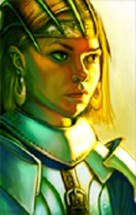

<html>

<b>The Sandrah Saga</b>

<b>Mod trilogy for EET</b>

The Idea 
With the EET possibility to play the Baldur’s Gate once again as one continuous game, the Sandrah Saga tries to create a character with her very own storyline spanning the complete saga (and more) who can accompany the player throughout the game. Her story is connected in many ways to the Bhaalspawn’s own quests. 
 
Sandrah is a young priestess of Mystra (fighter/cleric) from Waterdeep, the daughter of a famous character of the Realms, who steps out of her father’s mighty shadow to make herself an own name and also to discover the hidden part of her family history. This plot runs along the PC’s own discovery of who he/she is. Sandrah is a specialized healer, on the battlefield but also for those companions that suffer in heart and soul. 
 

The Sandrah Saga consists of three parts 
 - Sandrah Appears adds a joinable NPC and her story to the original game plot from Candlekeep to ToB >> https://github.com/RoxanneSHS/SandrahEET
 - Sandrah RtF (Return to Faerun) continues the Saga of the bhaalspawn PC and Sandrah with a new plot, old and new companions, old and new areas, old and new enemies, etc >> https://github.com/RoxanneSHS/SandrahRtF
 - Sandrah ToT (Time of Troubles Revisited) is an option to continue the game after RtF while storywise it takes you back into the time before the other events and you become the witness of the events that led to your birth in Baldur's Gate.>>  https://github.com/RoxanneSHS/SandrahToT

Installation 
Sandrah Saga requires a full installation of EET (including SoD) with all the “big mods” installed. Optional contents covers IWD in EET as well. 
All three parts must be installed before you start a new game in Candlekeep. BP-BGT worldmap must be installed after Sandrah mod to access all new areas. 
 
Additions 
- Alternative Portrait choices https://github.com/RoxanneSHS/SandrahPortrait/archive/master.zip
- Trilogy walkthrough https://github.com/PaulaMigrate/EETGuide/archive/master.zip

For an EET install including these mods, it is highly recommended to use the install tool https://github.com/EE-Mod-Setup/EE-Mod-Setup for correct install order and completeness.

  
  

 
&nbsp;

&nbsp;

</body>

</html>

